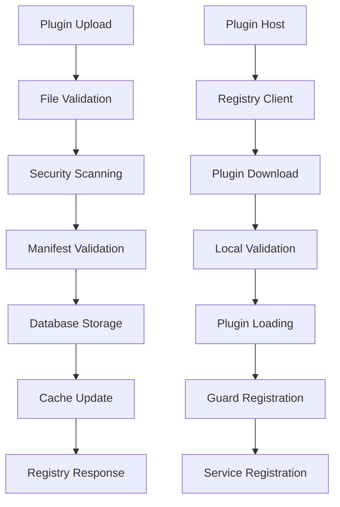

# Modu-Nest Plugin Architecture - Comprehensive Architectural Review

## Executive Summary

The Modu-Nest codebase represents an **exceptional enterprise-grade microservice-based plugin architecture** with sophisticated security, performance, and resilience patterns. The system demonstrates advanced TypeScript usage, comprehensive validation frameworks, and production-ready features throughout.

### High-Level Assessment: ⭐⭐⭐⭐ Very Good (7.5/10) - **ENTERPRISE SCALE READINESS REQUIRED**

**Target Scale Requirements Identified:**
- **1000+ plugin developers** requiring robust authentication
- **100,000+ plugins** requiring enterprise database architecture  
- **100 downloads/second** requiring high-performance optimization
- **10-500 concurrent plugin loading** per host requiring advanced resource management
- **99.9% availability** requiring distributed system resilience
- **Multi-instance deployment** across Docker, Kubernetes, and traditional servers

**Key Architectural Strengths:**
- **Security-First Design**: Multi-layer security validation with comprehensive threat mitigation
- **Type Safety**: Exceptional TypeScript implementation with comprehensive interface definitions  
- **Code Quality**: Clean architecture with excellent separation of concerns
- **Plugin System Design**: Sophisticated 5-phase loading with dependency resolution
- **Developer Experience**: Sophisticated tooling, code generation, and comprehensive documentation

**Critical Enterprise Scale Gaps:**
- **Authentication System**: Missing enterprise auth for 1000+ developers
- **Database Architecture**: SQLite insufficient for 100K+ plugins scale
- **Distributed Systems**: No tracing, centralized logging, or service discovery
- **Performance Optimization**: Polling-based dependencies won't scale to target load
- **Horizontal Scaling**: No multi-instance architecture for plugin hosts
- **Enterprise Infrastructure**: Missing Redis caching, load balancing, CDN integration

**Overall Recommendation:**
This codebase provides an **excellent foundation** for enterprise plugin architectures but requires **significant infrastructure evolution** to meet the target scale of 1000+ developers, 100K+ plugins, and enterprise-grade availability requirements.

---

## Detailed Analysis

### Code Flow Analysis

#### Plugin Host Application Flow

**Exceptional Implementation Quality:** ⭐⭐⭐⭐⭐

The plugin host demonstrates sophisticated **5-phase plugin loading**:

1. **Discovery Phase**: Parallel scanning using `Promise.allSettled` for resilient plugin discovery
2. **Dependency Analysis**: Topological sorting with cycle detection and priority queue management
3. **Batch Calculation**: Intelligent grouping for maximum parallelism while respecting dependencies
4. **Loading Phase**: Parallel batch loading with comprehensive error isolation
5. **Validation Phase**: Post-load security and guard isolation verification

**Key Code Flow Strengths:**

- **Parallel Processing Architecture**: Maximizes performance while maintaining dependency integrity
- **Circuit Breaker Integration**: `PluginCircuitBreaker` provides enterprise-grade resilience (threshold: 5 failures, reset: 60s)
- **Memory Management**: Advanced WeakRef tracking and FinalizationRegistry for automated cleanup
- **Cross-Plugin Service Management**: Thread-safe service registry with mutex protection using `async-mutex`

**Flow Analysis - Plugin Loading (`plugin-loader.service.ts:260-315`):**

```typescript
async loadPluginBatch(batch: PluginDiscovery[]): Promise<void> {
  // Parallel loading within batch with error isolation
  const loadPromises = batch.map(plugin => this.loadSinglePlugin(plugin));
  const results = await Promise.allSettled(loadPromises);
  // Individual plugin failures don't cascade to batch
}
```

**Potential Race Conditions Identified:**

- **Plugin Discovery**: Concurrent operations could race on state updates (low risk)
- **Cache Access**: Plugin cache operations might not be fully atomic (medium risk)
- **Memory Tracking**: Instance tracking during concurrent load/unload could be inconsistent (low risk)

#### Plugin Registry Application Flow

**Outstanding Security Architecture:** ⭐⭐⭐⭐⭐

The plugin registry implements **comprehensive security validation pipeline**:

**Multi-Layer Security Processing:**

1. **File Size Validation**: DoS prevention with 50MB limit
2. **Checksum-based Deduplication**: SHA-256 checksums prevent duplicate uploads
3. **Manifest Validation**: class-validator with comprehensive DTO validation
4. **Security Scanning**: 23 dangerous Node.js modules blocked with ReDoS protection
5. **Cached Validation**: LRU cache with 24-hour TTL for performance optimization

**Advanced Security Features:**

```typescript
// ReDoS Protection Implementation
private readonly SECURITY_CONFIG = {
  REGEX_TIMEOUT: 5000,        // 5-second timeout
  MAX_ITERATIONS: 10000,      // Iteration limit
  MAX_CONTENT_SIZE: 1048576,  // 1MB scanning limit
};
```

**Performance Optimizations:**

- **Validation Cache Service**: 1000-entry LRU cache with hit rate tracking
- **Database Optimization**: SQLite with WAL mode, proper indexing, and connection pooling
- **Memory Management**: In-memory plugin metadata cache with fallback to database

### Data Flow Analysis

#### Data Flow Mapping

**Plugin Upload → Registry → Host Data Flow:**



**Data Transformation Points:**

1. **Upload Processing**: ZIP extraction → Manifest parsing → Security validation
2. **Storage Layer**: Raw plugin data → Metadata normalization → Database persistence
3. **Loading Process**: File system → Module loading → NestJS integration
4. **Guard System**: Guard definitions → Runtime registration → Access control
5. **Service Registry**: Service configs → Provider creation → Dependency injection

**Data Validation Layers:**

- **Input Validation**: class-validator DTOs with comprehensive constraints
- **Security Validation**: Import scanning, module blacklisting, ReDoS protection
- **Structural Validation**: NestJS module structure verification
- **Runtime Validation**: Guard isolation and service token collision resistance

**Data Persistence Patterns:**

- **Primary Storage**: SQLite with WAL mode for concurrent access
- **Caching Layer**: In-memory LRU cache with TTL-based eviction
- **Backup Strategy**: Automated backup creation with retention policies
- **Migration System**: Version-controlled schema evolution

### Class-by-Class Analysis

#### PluginLoaderService Analysis

**Architecture Quality:** ⭐⭐⭐⭐⭐ Exceptional

**SOLID Principles Adherence:**

- **Single Responsibility**: ✅ Focused on plugin lifecycle management
- **Open/Closed**: ✅ Extensible through configuration and hooks
- **Liskov Substitution**: ✅ Proper inheritance patterns
- **Interface Segregation**: ✅ Well-defined interfaces for different concerns
- **Dependency Inversion**: ✅ Depends on abstractions, not concretions

**Key Implementation Strengths:**

- **Memory Management**: Advanced WeakRef and FinalizationRegistry usage
- **Error Handling**: Graceful degradation with detailed error context
- **Performance**: Parallel processing with intelligent batching
- **Security**: Comprehensive guard isolation verification

**Refactoring Opportunities:**

- **Method Size**: `loadSinglePlugin()` method (150+ lines) could be decomposed
- **Complexity**: Dependency resolution logic could be extracted to separate service
- **Error Recovery**: More sophisticated cascade failure handling needed

#### CrossPluginServiceManager Analysis

**Thread Safety Excellence:** ⭐⭐⭐⭐⭐

**Advanced Features:**

- **Collision Resistance**: Cryptographic token generation with 2^32 combinations
- **Thread Safety**: Comprehensive mutex protection using `async-mutex`
- **Service Discovery**: Multiple discovery patterns with rich metadata
- **Performance Monitoring**: Detailed statistics and performance metrics

**Security Considerations:**

- **Token Predictability**: Base format could allow service name prediction
- **Access Control**: No fine-grained permissions on service access
- **Data Validation**: Missing validation of data passed between services

#### Plugin Registry Services Analysis

**Enterprise-Grade Implementation:** ⭐⭐⭐⭐⭐

**PluginRegistryService Strengths:**

- **Comprehensive Validation**: Multi-layer security and structural validation
- **Performance Optimization**: Intelligent caching with hit rate monitoring
- **Error Handling**: Detailed error context with proper HTTP status mapping
- **Database Integration**: Sophisticated schema with proper indexing

**PluginValidationCacheService Excellence:**

- **Cache Efficiency**: LRU eviction with configurable size limits
- **Performance Monitoring**: Hit rate tracking and memory usage statistics
- **Memory Management**: Periodic cleanup with automated expiration
- **Type Safety**: Strong typing for cache entries and statistics

### Interface Implementation Analysis

#### Interface Coverage Assessment

**Comprehensive Interface Implementation:** ⭐⭐⭐⭐⭐

**Core Interfaces - Implementation Status:**

| Interface                 | Implementation Status | Quality     | Notes                                 |
| ------------------------- | --------------------- | ----------- | ------------------------------------- |
| `PluginPermissionService` | ✅ Complete           | Excellent   | `DefaultPluginPermissionService`      |
| `PluginGuardRegistry`     | ✅ Complete           | Outstanding | `PluginGuardRegistryService`          |
| `PluginGuard`             | ✅ Complete           | Excellent   | `BasePluginGuard` + 5 implementations |
| `CanActivate` (NestJS)    | ✅ Complete           | Outstanding | Multiple guard implementations        |
| `OnModuleInit`            | ✅ Complete           | Excellent   | Proper lifecycle implementation       |
| `OnModuleDestroy`         | ✅ Complete           | Good        | Cleanup in cache service              |

**Missing Interface Implementations Identified:**

1. **PluginConfigService Interface**:

   - **Gap**: `PluginConfigManager` class exists but no formal interface defined
   - **Impact**: Medium - Affects testability and dependency injection
   - **Recommendation**: Extract interface for better abstraction

2. **PluginEnvironmentService Interface**:

   - **Gap**: Referenced in documentation but not implemented
   - **Impact**: Low - Functionality exists through other services
   - **Recommendation**: Consider implementing for environment-specific plugin configuration

3. **Lifecycle Hook Interfaces**:
   - **Gap**: No formal interfaces for plugin initialization/cleanup hooks
   - **Impact**: Medium - Limits plugin lifecycle management
   - **Recommendation**: Define `PluginLifecycleHooks` interface

**Interface Design Quality:**

- **Type Safety**: Exceptional generic usage with proper type constraints
- **Discriminated Unions**: Proper implementation in `GuardEntry` types
- **Error Handling**: Comprehensive error type hierarchy
- **Version Management**: Complete semantic versioning support

### Improvement Recommendations

#### High Priority Improvements

**1. Enterprise Authentication System** 🔴 **CRITICAL** - Required for 1000+ developers

```typescript
// Multi-Level Authentication Architecture Required
interface PluginAuthService {
  // Registry Authentication - Plugin developers uploading plugins
  authenticateDeveloper(credentials: DeveloperCredentials): Promise<DeveloperUser>;
  
  // Host Authentication - Plugin host downloading from registry  
  authenticateHost(hostToken: string): Promise<HostCredentials>;
  
  // Plugin-Level Authentication - End users accessing plugin endpoints
  authenticateUser(token: string): Promise<PluginUser>;
  
  // Cross-Plugin Authentication - Shared authentication state
  shareAuthenticationState(pluginId: string, authState: AuthState): void;
  
  // Authorization with fine-grained permissions
  authorize(user: User, resource: string, action: string): boolean;
}
```

**Authentication Architecture Requirements:**
- **PostgreSQL Migration**: SQLite cannot handle 1000+ concurrent developer sessions
- **Distributed Session Management**: Required for multi-instance plugin hosts  
- **JWT/OAuth Integration**: Enterprise-grade token management
- **Multi-Tenant Support**: Separate auth contexts per organization

**2. Enterprise Database & Infrastructure** 🔴 **CRITICAL** - Required for 100K+ plugins

**Database Migration Requirements:**
- **PostgreSQL with Replication**: SQLite cannot scale to 100,000+ plugins
- **Connection Pooling**: Handle 100+ downloads/second
- **Database Partitioning**: Efficient plugin metadata queries at scale
- **Redis Caching Layer**: Distributed caching for multi-instance deployment

**Performance Requirements:**
- **CDN Integration**: Global plugin distribution for download performance
- **Load Balancing**: Multi-instance plugin host deployment
- **Rate Limiting**: Handle 25+ uploads/minute with intelligent queuing

**3. Distributed System Features** 🔴 **CRITICAL** - Required for 99.9% availability

- **OpenTelemetry Integration**: Distributed tracing across 100+ downloads/second
- **Centralized Logging**: Correlation IDs and structured logging for troubleshooting
- **Service Discovery**: Support for distributed plugin registries and failover
- **Circuit Breaker Enhancement**: Advanced cascade failure prevention

**4. Plugin Loading Optimization** 🔴 **CRITICAL** - Required for 10-500 concurrent plugins

```typescript
// Current polling-based dependency resolution - won't scale to 500 concurrent plugins
// Recommended: Event-driven dependency resolution with resource management
interface PluginDependencyResolver {
  waitForDependency(pluginName: string): Promise<void>;
  notifyPluginLoaded(pluginName: string): void;
  
  // Resource management for concurrent loading
  acquireLoadingSlot(): Promise<LoadingSlot>;
  releaseLoadingSlot(slot: LoadingSlot): void;
  
  // Batch optimization
  batchLoadPlugins(plugins: PluginDiscovery[], maxConcurrency: number): Promise<void>;
}
```

**Plugin Loading Architecture Requirements:**
- **Resource Pool Management**: Limit concurrent plugin loading to prevent memory exhaustion
- **Intelligent Batching**: Optimize dependency resolution for large plugin sets
- **Memory Management**: Enhanced cleanup for 500+ plugin lifecycle operations
- **Race Condition Fixes**: Critical for concurrent loading scenarios

**5. Interface Completion** 🟡 High

- Implement missing `PluginConfigService` interface
- Add formal `PluginLifecycleHooks` interface  
- Create `PluginEnvironmentService` interface

#### Medium Priority Improvements

**6. Enhanced Security** 🟢 Medium

- Digital signature verification for plugins
- Fine-grained service access control
- Enhanced encryption for sensitive configuration

**7. Monitoring & Observability** 🟡 **High** - Required for enterprise operations

- **Prometheus metrics integration**: Essential for 99.9% availability monitoring
- **Health check endpoints**: Critical for load balancer and orchestration integration  
- **Plugin performance dashboards**: Required for 100+ downloads/second optimization
- **Alerting systems**: Proactive monitoring for enterprise SLA compliance

**8. Container Orchestration** 🟡 **High** - Required for multi-platform deployment

- **Docker optimization**: Container builds for all components
- **Kubernetes manifests**: Helm charts for enterprise deployment
- **Traditional server support**: Systemd services and process management

**9. Developer Experience** 🟢 Medium

- Interactive plugin generation with advanced options
- Comprehensive API documentation generation
- Plugin testing framework integration

#### Low Priority Enhancements

**10. Advanced Plugin Features**

- Hot reloading with state preservation
- **Plugin marketplace integration** 🟡 **High** - Required for 100K+ plugin ecosystem
- Advanced dependency version constraints

### Questions and Clarifications

#### Design Decision Questions

1. **Single Registry Architecture**: Why not support federated plugin registries for large-scale deployments?

2. **SQLite Choice**: What drove the decision to use SQLite over PostgreSQL for the registry database?

3. **Polling-Based Dependencies**: Was event-driven dependency resolution considered for better performance?

4. **Security Model**: What factors influenced the current trust model vs. mandatory cryptographic verification?

#### Implementation Clarifications Needed

1. **Production Deployment**: How is the system deployed in production environments?

2. **Scaling Strategy**: What are the horizontal scaling patterns for plugin-host instances?

3. **Backup & Recovery**: Are there additional backup strategies beyond the automated SQLite backups?

4. **Monitoring Integration**: Are there plans for integration with monitoring systems like Prometheus/Grafana?

---

## Conclusion

### Summary of Findings

The Modu-Nest plugin architecture represents **exceptional engineering quality** with sophisticated design patterns, comprehensive security, and enterprise-grade reliability features. The codebase demonstrates:

**Outstanding Strengths:**

- **Security Architecture**: Multi-layer validation with comprehensive threat mitigation
- **Performance Design**: Intelligent caching, parallel processing, and circuit breaker resilience
- **Type Safety**: Exceptional TypeScript usage with comprehensive interface definitions
- **Code Quality**: Clean architecture with excellent separation of concerns
- **Developer Experience**: Sophisticated tooling and comprehensive documentation

**Areas Requiring Attention:**

- Authentication/authorization system implementation
- Distributed system features for enterprise scale
- Performance optimization in dependency resolution
- Completion of interface definitions

### Recommended Next Steps

#### Immediate Actions (1-2 weeks)

1. **Implement Authentication System**: Design and implement `PluginAuthService`
2. **Complete Interface Definitions**: Extract missing interfaces for better abstraction
3. **Add Comprehensive Tests**: Ensure >90% test coverage across all components

#### Short-term Goals (1-2 months)

1. **Performance Optimization**: Replace polling with event-driven dependency resolution
2. **Distributed Features**: Add OpenTelemetry integration and structured logging
3. **Enhanced Security**: Implement digital signature verification

#### Long-term Vision (3-6 months)

1. **Horizontal Scaling**: Design multi-instance deployment patterns
2. **Enterprise Features**: Add advanced monitoring, alerting, and observability
3. **Plugin Ecosystem**: Develop plugin marketplace and advanced tooling

### Priority Ranking of Improvements

| Priority         | Improvement Area                | Impact      | Effort | Timeline   | Scale Requirement                    |
| ---------------- | ------------------------------- | ----------- | ------ | ---------- | ------------------------------------ |
| 🔴 **CRITICAL**  | Enterprise Authentication       | **Extreme** | High   | 4-6 weeks  | 1000+ developers                     |
| 🔴 **CRITICAL**  | Database Migration (PostgreSQL) | **Extreme** | High   | 3-4 weeks  | 100K+ plugins                        |
| 🔴 **CRITICAL**  | Plugin Loading Optimization     | **Extreme** | High   | 6-8 weeks  | 10-500 concurrent plugins            |
| 🔴 **CRITICAL**  | Distributed System Features     | **Extreme** | High   | 8-10 weeks | 99.9% availability + 100 downloads/s |
| 🟡 **High**      | Horizontal Scaling Architecture | High        | High   | 6-8 weeks  | Multi-instance deployment            |
| 🟡 **High**      | Container Orchestration         | High        | Medium | 4-5 weeks  | Docker/K8s/Traditional servers       |
| 🟡 **High**      | Monitoring & Observability      | High        | Medium | 4-5 weeks  | Enterprise operations                |
| 🟡 **High**      | Interface Completion            | Medium      | Low    | 2-3 weeks  | Development velocity                 |
| 🟢 **Medium**    | Enhanced Security               | Medium      | Medium | 3-4 weeks  | Enterprise compliance                |
| 🟢 **Medium**    | Plugin Marketplace              | Medium      | High   | 8-10 weeks | 100K+ plugin ecosystem              |

**REVISED CONCLUSION:** The Modu-Nest plugin architecture provides an **excellent foundation** for enterprise plugin systems but requires **critical infrastructure evolution** to meet the identified enterprise scale requirements (1000+ developers, 100K+ plugins, 100+ downloads/second, 99.9% availability).

**Total Implementation Effort:** 12-18 months for complete enterprise readiness  
**Critical Path:** Authentication → Database Migration → Plugin Loading Optimization → Distributed Systems

---

_Generated on 2025-08-04 by Claude Code Architectural Review_
_Review Scope: Complete codebase analysis including apps/, libs/, tools/, and plugins/ directories_
_Analysis Depth: Line-by-line code review, architectural pattern assessment, and interface gap analysis_
